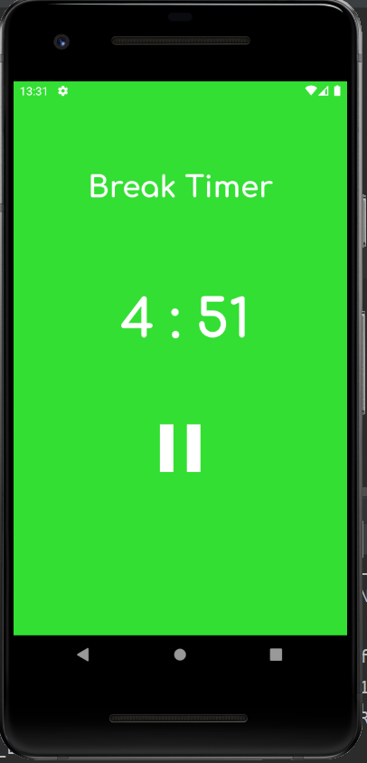
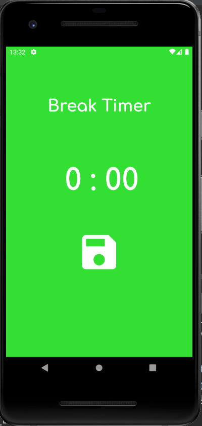
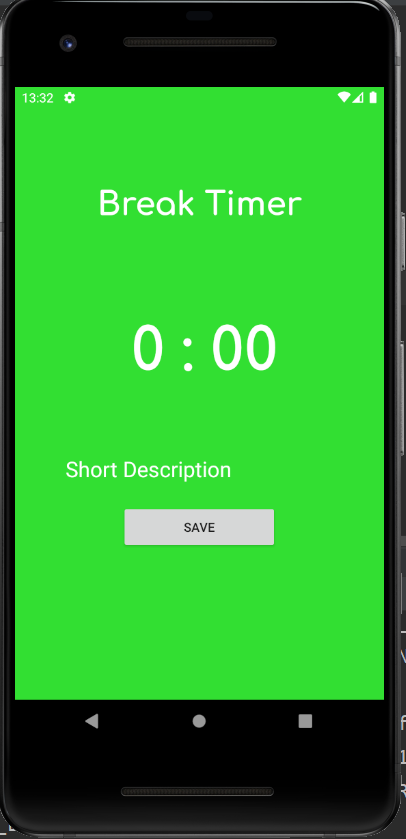
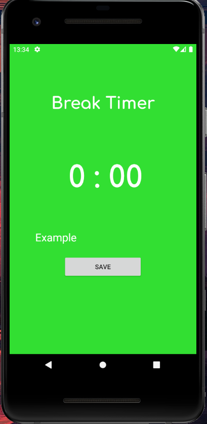
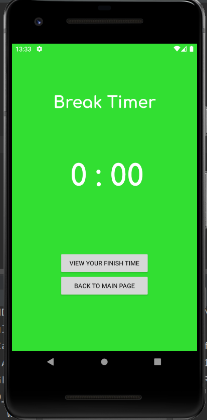
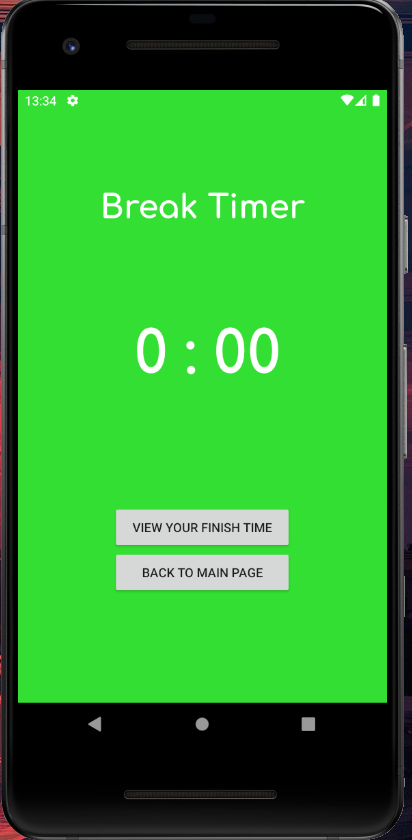
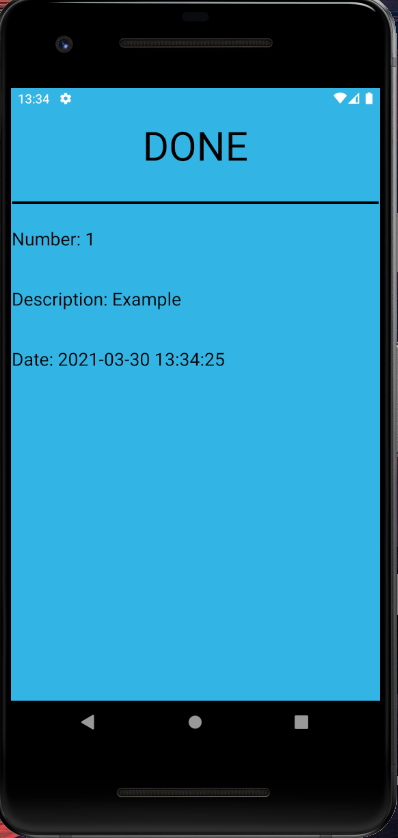

# Pomodoro-Timer

Pomodoro Tekniği 25 dakikalık çalışma ve 5 dakikalık molalardan oluşan çalışma tekniğidir. Bu program sizin pomodoro tekniğindeki çalışma zamanını ve mola zamanını kontrol 
etmenize ve bu çalışmaları kaydetmenize yarar.

## Çalışma Zamanı
 

Çalışmanız zamanı başlatıp durdurabileceğiniz, resetleyebileceğiniz sayfa.

## Mola Zamanı
 
   

Çalışma zamanı bittikten sonra otomatik olarak mola zamanı sayfasına geçer ve kısa bir açıklama ile çalışmayı yaptıgınız saati sqlite veritabanini kullanarak kayıt tutar.

## Kayıtlarımız
 

Bu zamana kadar yapmış oldugunuz çalışmaları gösteren sayfa.
